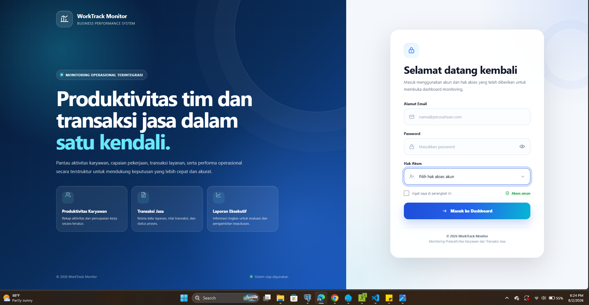

Dashboard Monitoring Perusahaan Jasa

Sistem informasi berbasis web untuk memonitor produktivitas karyawan, absensi, transaksi jasa, pendapatan, pengeluaran, dan kepuasan pelanggan secara terintegrasi.

 

 

<em>
Tampilan Dashboard Eksekutif untuk memonitor produktivitas karyawan,
transaksi jasa, pendapatan, dan aktivitas operasional perusahaan.
</em>

Daftar Isi

Tentang Aplikasi

Tampilan Aplikasi

Fitur Utama

Teknologi yang Digunakan

Persyaratan Sistem

Instalasi

Struktur Modul Database

Struktur Direktori Gambar

Keamanan

Penilaian Akhir

Kontribusi

Lisensi

Tentang Aplikasi

Dashboard Monitoring Perusahaan Jasa merupakan aplikasi berbasis web yang dikembangkan untuk membantu perusahaan dalam memonitor dan mengelola aktivitas operasional secara terintegrasi.

Aplikasi ini mencakup pengelolaan:

Data karyawan

Departemen dan jabatan

Jadwal kerja

Absensi dan cuti

Target serta penilaian kinerja

Pelanggan dan layanan

Transaksi jasa

Invoice dan pembayaran

Pengeluaran perusahaan

Kepuasan serta keluhan pelanggan

Laporan dan dashboard eksekutif

Informasi utama ditampilkan dalam dashboard interaktif agar manajemen dapat memantau kondisi perusahaan dan mengambil keputusan berdasarkan data yang tersedia.

Tampilan Aplikasi

Halaman Login

Halaman login digunakan untuk mengamankan akses ke dalam sistem. Setiap pengguna hanya dapat mengakses fitur dan menu sesuai dengan peran serta hak akses yang telah diberikan.

Dashboard Eksekutif

Dashboard Eksekutif menampilkan informasi penting perusahaan, antara lain:

Produktivitas karyawan

Rekapitulasi absensi

Jumlah transaksi jasa

Pendapatan dan pengeluaran

Invoice yang belum dibayar

Tingkat kepuasan pelanggan

Jumlah keluhan pelanggan

Manajemen Karyawan

Modul Manajemen Karyawan digunakan untuk mengelola:

Data karyawan

Departemen

Jabatan

Jadwal kerja

Penempatan jadwal

Status kepegawaian

Transaksi Jasa

Modul Transaksi Jasa digunakan untuk mengelola:

Pesanan pelanggan

Detail layanan

Penugasan pekerjaan

Riwayat status pekerjaan

Invoice

Pembayaran

Pengeluaran transaksi

Kepuasan Pelanggan

Modul Kepuasan Pelanggan digunakan untuk mencatat:

Penilaian kualitas pelayanan

Penilaian kinerja karyawan

Penilaian ketepatan waktu

Penilaian harga

Komentar pelanggan

Keluhan pelanggan

Status penyelesaian keluhan

Galeri Tampilan

<table>
    <tr>
        <td align="center" width="50%">
            
             
            <strong>Halaman Login</strong>
        </td>
        <td align="center" width="50%">
            
             
            <strong>Dashboard Eksekutif</strong>
        </td>
    </tr>
    <tr>
        <td align="center" width="50%">
            
             
            <strong>Manajemen Karyawan</strong>
        </td>
        <td align="center" width="50%">
            
             
            <strong>Transaksi Jasa</strong>
        </td>
    </tr>
</table>

Fitur Utama

1. Autentikasi dan Hak Akses

Login dan logout pengguna

Manajemen akun pengguna

Manajemen role dan permission

Pembatasan menu berdasarkan hak akses

Manajemen sesi pengguna

Perubahan kata sandi

Status aktif dan nonaktif pengguna

2. Manajemen Karyawan

Data karyawan

Data departemen

Data jabatan

Jadwal kerja

Penempatan jadwal karyawan

Status kepegawaian

Riwayat data karyawan

3. Absensi dan Cuti

Pencatatan jam masuk

Pencatatan jam pulang

Perhitungan keterlambatan

Perhitungan lembur

Status kehadiran

Pengajuan cuti

Persetujuan cuti

Penolakan cuti

Riwayat pengajuan cuti

4. Produktivitas Karyawan

Periode penilaian

Indikator kinerja atau KPI

Target karyawan

Aktivitas pekerjaan

Realisasi pekerjaan

Penilaian kinerja

Persentase pencapaian target

Peringkat karyawan

Riwayat hasil penilaian

5. Pelanggan dan Layanan

Data pelanggan

Kategori jasa

Data layanan

Harga layanan

Status layanan

Riwayat pelanggan

6. Transaksi Jasa

Pembuatan pesanan jasa

Detail item pesanan

Riwayat status pesanan

Penugasan pekerjaan

Invoice pelanggan

Pencatatan pembayaran

Pencatatan pengeluaran

Monitoring progres pekerjaan

Riwayat transaksi

7. Kepuasan Pelanggan

Penilaian kualitas pelayanan

Penilaian kinerja karyawan

Penilaian ketepatan waktu

Penilaian harga

Komentar pelanggan

Keluhan pelanggan

Tindak lanjut keluhan

Status penyelesaian keluhan

8. Dashboard Eksekutif

Statistik jumlah karyawan

Rekapitulasi absensi

Rekapitulasi pengajuan cuti

Produktivitas karyawan

Pencapaian target

Jumlah pelanggan

Jumlah transaksi jasa

Total pendapatan perusahaan

Total pengeluaran perusahaan

Invoice belum dibayar

Tingkat kepuasan pelanggan

Jumlah keluhan pelanggan

Grafik perkembangan transaksi

Grafik pendapatan dan pengeluaran

9. Fitur Pendukung

Notifikasi pengguna

Audit log aktivitas

Pengaturan sistem

Pencarian data

Filter data

Pengurutan data

Pagination

Soft delete

Restore data

Ekspor laporan

Tampilan responsif

Validasi formulir

Konfirmasi tindakan

Teknologi yang Digunakan

Teknologi

Keterangan

Laravel 13

Framework backend aplikasi

PHP 8.2+

Bahasa pemrograman backend

PostgreSQL

Sistem manajemen basis data

Blade

Template engine Laravel

Bootstrap 5

Framework antarmuka pengguna

JavaScript

Interaksi dan manipulasi halaman

Chart.js

Visualisasi grafik dashboard

HTML5

Struktur halaman aplikasi

CSS3

Desain dan tata letak halaman

Composer

Manajemen dependensi PHP

NPM

Manajemen dependensi frontend

Vite

Build tool untuk aset frontend

Git

Version control

GitHub

Repository dan kolaborasi kode

Persyaratan Sistem

Pastikan perangkat telah memiliki perangkat lunak berikut:

PHP 8.2 atau lebih baru

Composer

PostgreSQL

Node.js

NPM

Git

Web server Apache atau Nginx

Ekstensi PHP yang direkomendasikan:

php-pgsql

php-mbstring

php-xml

php-curl

php-zip

php-bcmath

php-fileinfo

php-tokenizer

Instalasi

1. Clone Repository

git clone https://github.com/USERNAME/NAMA-REPOSITORY.git

Masuk ke direktori aplikasi:

cd NAMA-REPOSITORY

2. Instal Dependensi PHP

composer install

3. Instal Dependensi Frontend

npm install

4. Salin File Environment

Untuk Linux atau macOS:

cp .env.example .env

Untuk Windows Command Prompt:

copy .env.example .env

5. Generate Application Key

php artisan key:generate

6. Konfigurasi Database

Buka file .env, kemudian sesuaikan konfigurasi berikut:

APP_NAME="Dashboard Monitoring Perusahaan Jasa"
APP_ENV=local
APP_KEY=
APP_DEBUG=true
APP_URL=http://localhost:8000

DB_CONNECTION=pgsql
DB_HOST=127.0.0.1
DB_PORT=5432
DB_DATABASE=dashboard_monitoring_jasa
DB_USERNAME=postgres
DB_PASSWORD=

7. Jalankan Migrasi Database

php artisan migrate

Apabila aplikasi menyediakan data awal melalui seeder, jalankan:

php artisan db:seed

Atau jalankan migrasi beserta seeder:

php artisan migrate --seed

8. Buat Symbolic Link Storage

php artisan storage:link

9. Jalankan Build Aset Frontend

Untuk mode pengembangan:

npm run dev

Untuk mode produksi:

npm run build

10. Jalankan Aplikasi

php artisan serve

Akses aplikasi melalui alamat berikut:

http://127.0.0.1:8000

Perintah Pengembangan

Membersihkan cache aplikasi:

php artisan optimize:clear

Membuat ulang cache konfigurasi:

php artisan config:cache

Membuat cache route:

php artisan route:cache

Membuat cache view:

php artisan view:cache

Menjalankan pengujian:

php artisan test

Menampilkan daftar route:

php artisan route:list

Struktur Modul Database

Database aplikasi dikelompokkan menjadi beberapa modul utama:

Autentikasi dan akses

Role dan permission

Organisasi dan karyawan

Absensi dan cuti

Produktivitas karyawan

Pelanggan dan jasa

Transaksi jasa

Kepuasan pelanggan

Notifikasi dan audit log

Pengaturan sistem

Pendukung dashboard

Tabel Utama

users
roles
permissions
role_user
permission_role

departments
positions
employees
work_schedules
employee_schedules

attendances
leave_requests

performance_periods
performance_indicators
employee_targets
employee_activities
employee_performances

customers
service_categories
services

service_orders
service_order_items
service_order_status_histories
service_assignments

invoices
payments
expenses

customer_feedback
customer_complaints

notifications
audit_logs
system_settings

Nama tabel pivot role dan permission dapat berbeda tergantung implementasi package atau struktur database yang digunakan.

Struktur Direktori Gambar

Agar seluruh gambar pada README dapat tampil dengan benar, gunakan struktur direktori berikut:

public/
└── backend/
    └── assets/
        └── img/
            ├── logo.png
            └── readme/
                ├── dashboard-preview.png
                ├── login-page.png
                ├── dashboard-eksekutif.png
                ├── data-karyawan.png
                ├── transaksi-jasa.png
                └── kepuasan-pelanggan.png

Pastikan penulisan nama file, huruf kapital, dan ekstensi gambar sesuai dengan file yang terdapat di repository.

Keamanan

Beberapa mekanisme keamanan yang digunakan dalam aplikasi:

Autentikasi pengguna

Otorisasi berdasarkan role dan permission

Proteksi CSRF

Validasi input

Hashing kata sandi

Middleware hak akses

Pembatasan akses route

Audit log aktivitas pengguna

Perlindungan mass assignment

Pengelolaan session

Soft delete untuk data tertentu

Jangan mengunggah file .env, credential database, API key, atau informasi sensitif lainnya ke repository publik.

Penilaian Akhir

Penilaian berikut disusun berdasarkan struktur modul, rancangan database, fitur yang didokumentasikan, alur transaksi, keamanan, serta kesiapan pengembangan yang dijelaskan dalam README ini. Penilaian ini belum menggantikan hasil pengujian langsung terhadap source code, database, antarmuka, keamanan, dan performa aplikasi.

Rekapitulasi Penilaian

Aspek yang Dinilai

Bobot

Nilai

Catatan

Kesesuaian kebutuhan bisnis

20%

17/20

Modul utama perusahaan jasa sudah tercakup, mulai dari karyawan, transaksi, keuangan, hingga pelanggan.

Kelengkapan fitur

15%

13/15

Fitur inti cukup lengkap, tetapi masih memerlukan penguatan pada approval berjenjang, SLA keluhan, dan rekonsiliasi pembayaran.

Struktur dan integrasi database

20%

15/20

Pengelompokan tabel sudah sistematis, tetapi beberapa relasi dan sumber data perlu diperjelas agar tidak terjadi duplikasi atau inkonsistensi.

Alur bisnis dan kontrol proses

15%

11/15

Alur dasar sudah tergambar, tetapi transisi status, verifikasi pekerjaan, cuti, invoice, dan pembayaran perlu dikontrol lebih ketat.

Keamanan dan hak akses

10%

8/10

Dokumentasi telah mencakup autentikasi, otorisasi, CSRF, validasi, hashing, middleware, dan audit log.

Kualitas dokumentasi

10%

9/10

README tersusun rapi, mudah dipahami, dan memuat instalasi, fitur, teknologi, struktur database, serta panduan kontribusi.

Kesiapan implementasi dan pengujian

10%

7/10

Aplikasi cukup siap dikembangkan, tetapi belum tersedia bukti hasil pengujian fungsional, integrasi, keamanan, dan performa.

Total

100%

80/100

Baik dan layak dikembangkan dengan beberapa revisi penting.

Predikat

Nilai akhir: 80/100 — Baik

Aplikasi telah memiliki fondasi yang cukup kuat untuk digunakan sebagai proyek sistem informasi perusahaan jasa. Struktur modulnya relevan dengan kebutuhan operasional dan manajerial, serta dokumentasinya sudah memberikan gambaran implementasi yang jelas.

Namun, sebelum digunakan pada lingkungan produksi, beberapa bagian perlu disempurnakan agar data yang ditampilkan pada dashboard benar-benar valid, konsisten, dapat diaudit, dan sesuai dengan alur bisnis perusahaan.

Kelebihan Utama

Cakupan modul relatif lengkap dan terintegrasi.

Pemisahan fitur berdasarkan domain bisnis sudah jelas.

Teknologi yang digunakan relevan untuk aplikasi web modern.

Dokumentasi instalasi dan pengembangan cukup sistematis.

Terdapat perhatian terhadap keamanan, audit log, validasi, dan pembatasan akses.

Dashboard eksekutif dirancang untuk mendukung pengambilan keputusan berbasis data.

Catatan Perbaikan Prioritas

Pastikan hubungan users, roles, dan permissions benar-benar diterapkan melalui tabel pivot atau package otorisasi yang konsisten.

Hubungkan aktivitas karyawan secara spesifik dengan item jasa atau penugasan yang dikerjakan.

Tetapkan aturan transisi status untuk pesanan, aktivitas, cuti, invoice, pembayaran, dan keluhan.

Pisahkan sumber data pesanan, invoice, pembayaran, dan pengeluaran agar tidak terjadi duplikasi nilai.

Tambahkan mekanisme invoice_items dan alokasi pembayaran apabila sistem mendukung pembayaran parsial atau satu pembayaran untuk beberapa invoice.

Hubungkan absensi dengan jadwal kerja agar keterlambatan, lembur, dan ketidakhadiran dapat dihitung secara akurat.

Tambahkan validasi database, seperti unique constraint, check constraint, serta pemeriksaan konsistensi tanggal dan nilai.

Hindari penghapusan transaksi keuangan; gunakan pembatalan, reversal, atau histori perubahan.

Gunakan query agregasi, database view, atau materialized view untuk dashboard agar data ringkasan tidak mudah berbeda dari data transaksi.

Lengkapi pengujian unit, feature, integration, authorization, database constraint, keamanan, dan performa.

Status Kelayakan

Status

Keterangan

Kelayakan akademik/proyek portofolio

Layak

Kelayakan pengembangan lanjutan

Layak dengan revisi

Kelayakan demonstrasi kepada pengguna

Layak setelah data uji tersedia

Kelayakan produksi

Belum direkomendasikan sebelum audit dan pengujian menyeluruh

Kesimpulan Penilaian

Secara keseluruhan, Dashboard Monitoring Perusahaan Jasa telah menunjukkan rancangan yang baik, relevan, dan cukup komprehensif. Nilai utama proyek ini terletak pada keluasan modul, integrasi fungsi operasional dan manajerial, serta penyajian informasi melalui dashboard eksekutif.

Meskipun demikian, kekuatan dashboard sangat bergantung pada kualitas alur transaksi dan integritas data di belakangnya. Oleh karena itu, prioritas pengembangan selanjutnya bukan hanya menambah tampilan atau fitur, tetapi memastikan bahwa setiap data mempunyai sumber yang jelas, proses verifikasi, aturan status, histori perubahan, dan relasi yang dapat dipertanggungjawabkan.

Dengan penyempurnaan tersebut, aplikasi berpotensi berkembang menjadi sistem monitoring perusahaan jasa yang stabil, terukur, aman, dan layak digunakan pada lingkungan operasional nyata.

Kontribusi

Kontribusi terhadap pengembangan aplikasi dapat dilakukan melalui langkah berikut:

Fork repository ini.

Buat branch fitur baru.

git checkout -b feature/nama-fitur

Lakukan perubahan dan commit.

git commit -m "feat: menambahkan nama fitur"

Push branch ke repository.

git push origin feature/nama-fitur

Buat Pull Request melalui GitHub.

Gunakan format commit yang jelas dan konsisten, misalnya:

feat: menambahkan fitur baru
fix: memperbaiki kesalahan aplikasi
docs: memperbarui dokumentasi
style: memperbaiki format kode
refactor: menyederhanakan struktur kode
test: menambahkan pengujian
chore: memperbarui konfigurasi proyek

Pelaporan Masalah

Apabila menemukan bug atau masalah pada aplikasi, buat laporan melalui halaman berikut:

https://github.com/USERNAME/NAMA-REPOSITORY/issues

Sertakan informasi berikut:

Deskripsi masalah

Langkah untuk menghasilkan masalah

Hasil yang diharapkan

Hasil yang terjadi

Screenshot apabila diperlukan

Versi PHP dan Laravel

Sistem operasi yang digunakan

Lisensi

Proyek ini didistribusikan berdasarkan lisensi yang tercantum pada file LICENSE.

Pengembang

Dikembangkan untuk mendukung proses monitoring dan pengambilan keputusan pada perusahaan jasa.

Dashboard Monitoring Perusahaan Jasa

